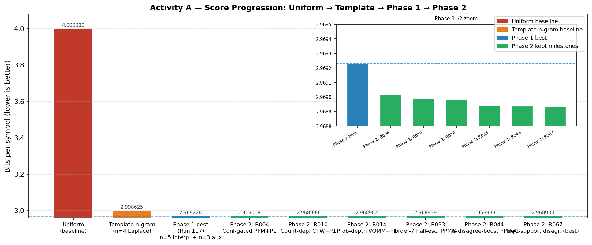

# Universal Source Modeling — Information Theory for Machine Learning

A Master's project on **universal source modeling**: building sequential next-symbol
predictors whose quality is measured directly in the currency of information theory —
**bits per symbol**, i.e. empirical cross-entropy, i.e. ideal code length.

> **Thesis.** Better next-symbol probabilities → shorter ideal code lengths → lower
> empirical cross-entropy. For a predictor `Q` against a source `P`, the excess over the
> source entropy is exactly the redundancy term in
> `H(P, Q) = H(P) + D(P‖Q)`. **Every modeling decision in this repository is an attempt to
> shrink `D(P‖Q)` — model mismatch — under hard online and runtime constraints.**

This single idea links the two activities below and the whole *Information Theory for ML*
course: entropy and relative entropy, source coding, arithmetic coding, and universal
compression (Lempel–Ziv, minimax redundancy).

---

## The two activities

| | **Activity A — Source Modeling** (primary) | **Activity B — LLMZip** (bonus) |
|---|---|---|
| **Task** | Online next-symbol prediction over a synthetic source, alphabet size 16 | Use a pretrained LLM as a sequential predictor to compress English (`text8`) |
| **Metric** | Empirical cross-entropy, **bits/symbol** | **bits/character** (and LLMZip rank-stream compression) |
| **Where** | Repo root (`competition/`, `submissions/`, `explanations/`, `EXPERIMENTS.md`) | [`activity_b_llmzip/`](activity_b_llmzip/) |
| **Score** | Uniform 4.000 → best **2.968933** bps | Classical ≈2.1 → **Qwen2.5-7B 0.624** bpc |

> **Repository layout note.** Activity A is the bulk of this work and occupies the repo
> root because its evaluator (`competition/`) and predictors (`submissions/`) are Python
> packages loaded from the root. Activity B is fully self-contained in its own directory.

---

## Headline results

**Activity A** — official evaluator, `N = 200,000` symbols, alphabet 16, context ≤ 256, ≤ 600 s, strictly causal:

| Milestone | bits/symbol | Note |
|---|---:|---|
| Uniform prior | 4.000000 | `log₂ 16` |
| Official n-gram baseline (n=4, Laplace) | 2.998625 | provided |
| Phase 1 best (Run 117) | 2.969228 | n=5 interpolated mixture + n=3 online auxiliary |
| **Phase 2 best (Run 067)** | **2.968933** | PPM-A stack + CTW/VOMM + support-conditioned JS-disagreement boost, deterministic |

The 25.8 % reduction from the uniform prior is almost entirely captured by Phase 1; the
67 Phase-2 runs add only ~3×10⁻⁴ bps. We report this honestly as evidence the model class
has reached the source's practical **entropy floor** — see [`docs/03_results.md`](docs/03_results.md).

**Activity B** — `text8`, bits/character (lower is better):

classical (`bz2` 2.098, `lzma` 2.198, `zlib` 2.638) → LLM **ideal code length** (token
cross-entropy per character) improves monotonically with scale (`distilgpt2` 1.254 →
`gpt2` 1.121 → `pythia-1b` 0.924 → `Qwen2.5-1.5B` 0.761 → **`Qwen2.5-7B` 0.624**). For
reference the LLMZip paper reports 0.710 bpc for LLaMA + *realized* arithmetic coding;
since our LLM figures are ideal codelengths the two aren't strictly comparable (our
comparable realized rank+lzma figure for Qwen2.5-7B is 0.724) — see
[`docs/03_results.md`](docs/03_results.md). A clean illustration of "scaling improves
compression."



---

## Documentation

| Doc | Contents |
|---|---|
| [`docs/01_problem_and_information_theory.md`](docs/01_problem_and_information_theory.md) | The problem, the scoring identity, why log-loss = ideal code length, `H(P,Q)=H(P)+D(P‖Q)` |
| [`docs/02_methodology.md`](docs/02_methodology.md) | The model families (n-gram → VOMM → CTW → PPM → hybrid stack) and the autonomous research loop |
| [`docs/03_results.md`](docs/03_results.md) | Full result tables, diminishing-returns analysis, figures |
| [`docs/04_skills_and_learnings.md`](docs/04_skills_and_learnings.md) | What the project demonstrates, mapped to course topics |
| [`submissions/README.md`](submissions/README.md) | The curated predictor progression + the `Predictor` interface |
| [`activity_b_llmzip/README.md`](activity_b_llmzip/README.md) | Activity B pipeline and reproduction |

---

## Quickstart

Python 3.12, managed with [`uv`](https://docs.astral.sh/uv/). `numpy` only for Activity A.

```bash
# Smoke test the best predictor (5,000 symbols)
uv run python -m competition.run_live_eval \
  --test-path data/public_practice/test.npy \
  --predictor-path submissions/cautious_support_conditioned_disagreement_boost_ppma_stack.py \
  --smoke-test

# Full official run (200,000 symbols) — the only official score
uv run python -m competition.run_live_eval \
  --test-path data/public_practice/test.npy \
  --predictor-path submissions/cautious_support_conditioned_disagreement_boost_ppma_stack.py
```

The official result is the single canonical line:

```
FINAL_SCORE bits_per_symbol=... elapsed_seconds=... timed_out=... evaluated_tokens=...
```

Activity B (GPU recommended): see [`activity_b_llmzip/README.md`](activity_b_llmzip/README.md).

---

## Repository map

```
competition/        Official read-only evaluator, harness, Predictor base, baselines, config
submissions/        Curated milestone predictors (+ supporting components) and the interface
explanations/       Per-run write-ups (the experimental journey)
EXPERIMENTS.md      Master run ledger
autoresearch.*      The autonomous experiment loop (mandate, config, logs, hooks)
data/               Synthetic source: training sequence + public practice set (see data/README.md)
docs/               Narrative: problem, methodology, results, skills, figures
notebooks/          Colab starter
scripts/, validation_script.py   Stability + train-derived validation helpers
activity_b_llmzip/  Activity B (LLMZip-style English compression) — self-contained
archive/            Frozen history: phase-1 n-gram exploration (121 runs) + phase-2 variants
```

## Notes on scope and provenance

- The synthetic source data is competition-provided and intended for sharing; see
  [`data/README.md`](data/README.md). The secret live test set is never included.
- Course lecture material (the professor's slides) is intentionally **excluded** from this
  public repository for copyright reasons; the information-theory write-ups in `docs/` are
  original.
- The official evaluator under `competition/` is treated as read-only; scores are produced
  only by it.

## License

[MIT](LICENSE) © 2026 MohammadErfan Jabbari. The `competition/` evaluator is course-provided
material included for reproducibility.
