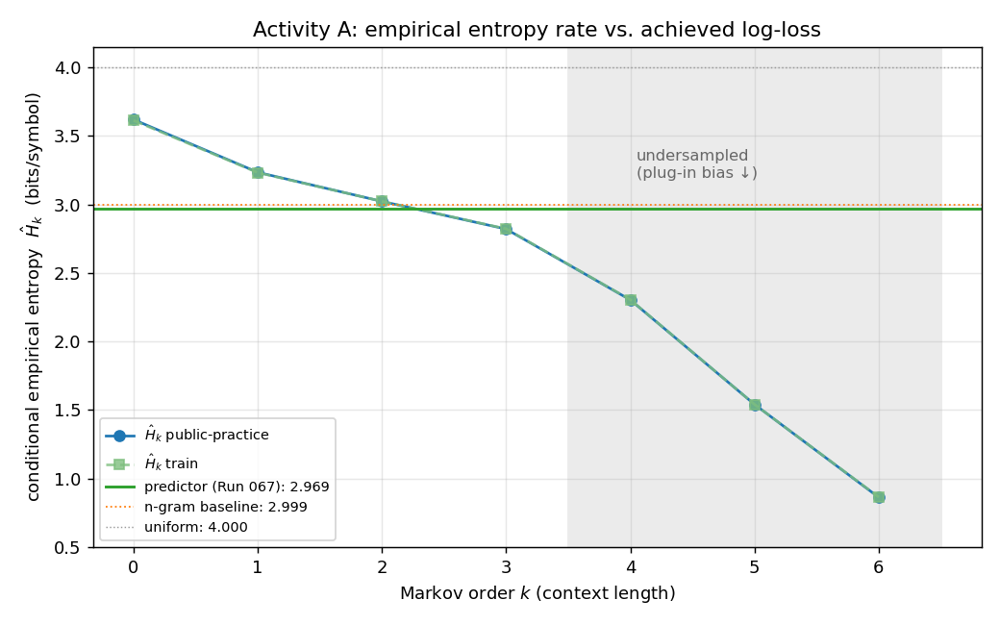
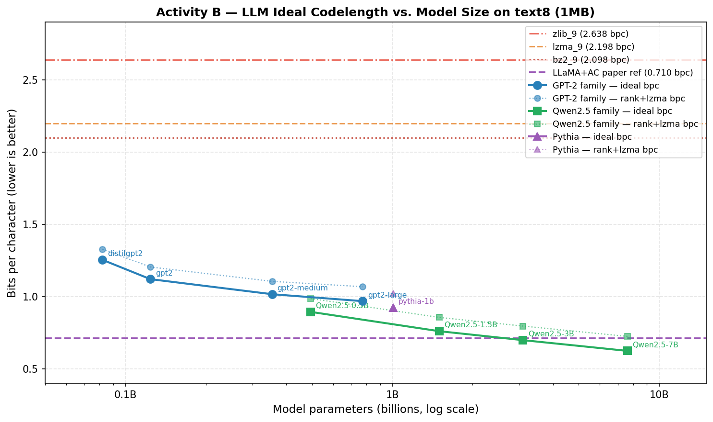

# Universal Source Modeling — Information Theory for Machine Learning

A predictor and a compressor are the same machine. If a model assigns the next symbol
probability `q`, the cheapest possible code spends `−log₂ q` bits to record it — so
predicting well and compressing well are the same skill, measured in the same unit: bits.
This project takes that equivalence literally and asks how close to the information-theoretic
floor a sequential predictor can get, in two settings.

The score throughout is empirical cross-entropy in **bits per symbol**,
`Ĥ_Q = (1/N) Σ −log₂ q_i(x_i | x_1^{i-1})`, which is exactly the average ideal code length
under the model. Against the true source `P`, the gap above its entropy is the redundancy term
in `H(P,Q) = H(P) + D(P‖Q)`. Every result below is an attempt to drive that redundancy —
pure model mismatch — toward zero under hard online and runtime constraints.

## Results at a glance

| | Activity A — synthetic source | Activity B — English (text8) |
|---|---|---|
| Predictor | online count-based models (NumPy) | pretrained LLMs as sequential predictors |
| Baseline → best | uniform 4.000 → **2.969** bits/symbol | classical `bz2` 2.098 → **0.624** bits/char (Qwen2.5-7B) |
| Headline finding | reaches the source's measured finite-order entropy rate | clean log-linear scaling: **−0.23 bits/char per 10× parameters** |




Three results worth stating plainly:

1. **We can locate the floor.** Estimating the synthetic source's conditional entropy directly
   from the data shows it is non-memoryless (`H₀=3.62 → H₁=3.23 → H₂=3.02 → H₃=2.82` bits) and that
   reliable estimation runs out past order ~3. Our predictor reaches **2.969** bits/symbol —
   below the order-2 entropy and approaching the order-3 estimate. After Phase 1, 67 further
   models bought only ~3×10⁻⁴ bits: the easy redundancy is gone, and what remains lives in
   sparsely-observed high-order contexts that are genuinely hard to estimate online.
2. **Compression scales with model size, predictably.** On English, LLM ideal code length
   falls log-linearly with parameters (R²≈0.99 within the Qwen family), crossing every
   classical compressor; Qwen2.5-7B reaches 0.624 bits/char.
3. **The two halves are the same problem.** Synthetic-source modeling and LLM text
   compression are one objective — minimize cross-entropy — viewed at two scales.

Full numbers, methodology, and the honest negative results are in [`docs/`](docs/).

## The two activities

**Activity A (root)** is the primary task: an online, strictly causal next-symbol predictor
over a size-16 synthetic source, scored on `N=200,000` symbols with context capped at 256 and
a 600-second budget. The constraints are the point — they rule out throwing a large model at
the problem and force cheap, count-based estimators with principled smoothing. Code lives in
[`competition/`](competition/) (the official evaluator) and [`submissions/`](submissions/).

**Activity B** ([`activity_b_llmzip/`](activity_b_llmzip/)) is an LLMZip-style study: use a
pretrained causal language model as a sequential predictor for English and measure its ideal
code length (and a practical rank-coding scheme) against classical compressors and the LLMZip
paper's reference numbers.

> Activity A occupies the repo root because its evaluator and predictors are Python packages
> loaded from there; Activity B is self-contained in its own directory.

## Documentation

| Doc | Contents |
|---|---|
| [`docs/01_problem_and_information_theory.md`](docs/01_problem_and_information_theory.md) | The problem and why log-loss is ideal code length; `H(P,Q)=H(P)+D(P‖Q)` |
| [`docs/02_methodology.md`](docs/02_methodology.md) | The models (n-gram → VOMM → CTW → PPM → hybrid stack), validation, the autonomous search loop |
| [`docs/03_results.md`](docs/03_results.md) | Full tables, the entropy-rate analysis, scaling law, ablation, limitations & future work |
| [`docs/04_skills_and_learnings.md`](docs/04_skills_and_learnings.md) | What the project demonstrates, honestly scoped |
| [`submissions/README.md`](submissions/README.md) | The curated predictor progression and the `Predictor` interface |
| [`activity_b_llmzip/README.md`](activity_b_llmzip/README.md) | Activity B pipeline and reproduction |

## Quickstart

Python 3.12 via [`uv`](https://docs.astral.sh/uv/); Activity A is NumPy-only.

```bash
# Full official run (200,000 symbols) — the only official score
uv run python -m competition.run_live_eval \
  --test-path data/public_practice/test.npy \
  --predictor-path submissions/cautious_support_conditioned_disagreement_boost_ppma_stack.py
# → FINAL_SCORE bits_per_symbol=2.9689330701 elapsed_seconds=~47 timed_out=False evaluated_tokens=200000

# Reproduce the entropy-rate analysis / figure
uv run python docs/figures/make_entropy_rate.py
```

Activity B (GPU recommended): see [`activity_b_llmzip/README.md`](activity_b_llmzip/README.md).

## Repository map

```
competition/        Official read-only evaluator, harness, Predictor base, config
submissions/        Curated milestone predictors (+ supporting components) and the interface
explanations/       Per-run write-ups (the experimental record)
EXPERIMENTS.md      Master run ledger
autoresearch.*      The autonomous experiment loop (mandate, config, logs)
data/               Synthetic source: training + public-practice sequences (see data/README.md)
docs/               Problem, methodology, results, skills, and the figure-generation scripts
activity_b_llmzip/  Activity B (LLMZip-style English compression) — self-contained
archive/            Frozen history: Phase-1 n-gram exploration (121 runs) + Phase-2 variants
```

## Provenance and license

The synthetic data is competition-provided (see [`data/README.md`](data/README.md)); the secret
live test set is never included. Course lecture material is intentionally excluded for copyright
reasons, and the write-ups in `docs/` are original. The evaluator under `competition/` is
course-provided and treated as read-only.

[MIT](LICENSE) © 2026 MohammadErfan Jabbari.
